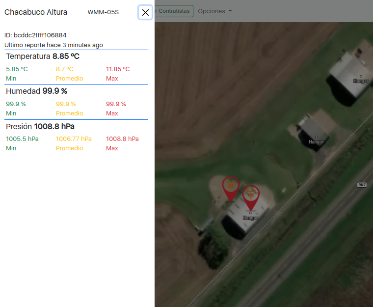

# Reporte de Cambios 2022-08-01

## Nueva estructura de 'Insumos'
La nueva estructura de los items de insumo permite, ademas de ver los detalles tradicionales (como nombre comercial, tipo, etc.), ver y establecer los parametros de margenes de dosis y estadios vegetales para los cuales se puede aplicar el producto.


```javascript
interface Insumo {
  _id: string,
  uuid: string;
  marca_comercial: string;
  principio_activo: string;
  tipo: string;
  subtipo: string;
  unidad: string;
  precio: number;
  se_aplica_a:  {       cultivo : any;
                        uuid: string;
                        estadio_desde: string;
                        estadio_hasta: string;
                        dosis_min: number;
                        dosis_max: number;
                        dosis_sugerida: number;
                };
  
}
```

En el futuro se puede utilizar la información de estadios vegetales para darle sugerencias al usuario de que productos puede aplicar basado en el desarrollo observado actual.

### Inicialización
El programa ya tiene cargado una lista de mas de 5000 insumos iniciales (obtenido de diversas fuentes) que el usuario puede extender o editar de ser necesario.

### Exportacion Excel
Es posible exportar una planilla de Excel con toda la información de insumos.


<p align="center">

</p>


## Codigo Fuente al 20220801
**[Google Drive link '.zip'](https://eff.org)**