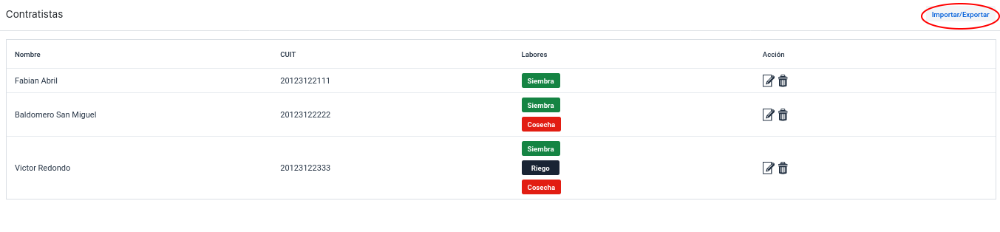
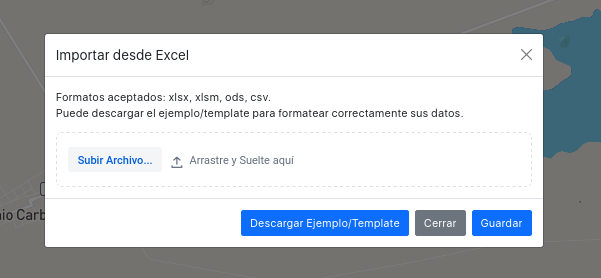
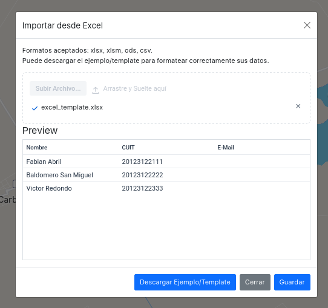
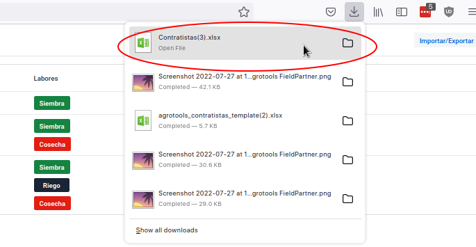

# Reporte de Cambios 2022-08-01

## Nueva estructura de Insumos

### Inicialización

### Insumos en Siembra

### Insumos en Cosecha
Ahora se puede consultar la telemetria de las centrales de Chacabuco.

### Iconos indicadores Mapa
Los marcadores en el Mapa tienen un icono de "central meteorológica" para "mejor" identificación y en el futuro diferenciarlos de tracker u otros dispositivos.

## Importación Excel Contratistas
Se pueden importar los contratistas utilizando un archivo xlsx, .csv u .ods.

Al hacer click en "Importar Excel" aparece una ventana modal en donde se puede subir un archivo.

También se puede descargar un ejemplo o template de la forma en la que necesitan ser formateados los datos. 
Es vital conservar los encabezados.

ToDo: Usar CUIT como id para que se puedan actualizar los contratistas existentes.

Cuando se carga un archivo se pueden ver el nombre, cuit e email a modo de previsualización en una tabla que aparece en el mismo modal. Los datos son grabados en la base de datos una vez que se clickea "Guardar".

## Exportación Excel Contratistas

Se puede descargar la lista actual de contratistas a un archivo xlsx que tiene un formato identico al ejemplo/template.

