# Reporte de Cambios 2022-08-16

## Cambio de Iconos Centrales Meteorológicas.
Las centrales tiene ahora el icono provisto.


<p align="center">
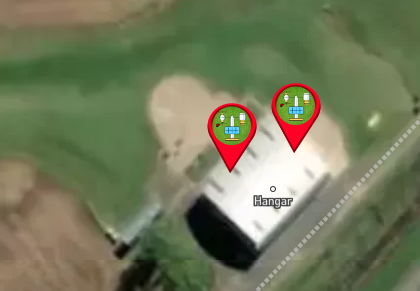
</p>

## Iconos en Actividades
Se utilizan los mismos iconos para distingir actividades (sembradora, cosechadora, pulverizadora).


<p align="center">
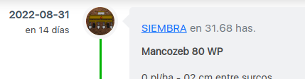
</p>

## Insumos - Precio
Los insumos cuentan ahora con una columna de precio.


<p align="center">
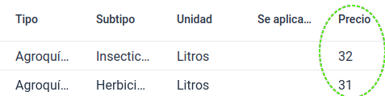
</p>

## Insumos - Importar desde Excel
Se puede usar una hoja de Excel para Importar Insumos. Al igual que el caso de Contratistas, se puede descargar el template correspondiente.


<p align="center">
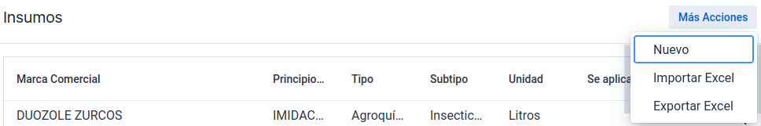
</p>

<p align="center">
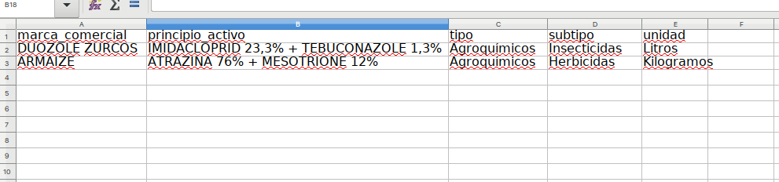
</p>


## Siembra - Insumos
Ahora la actividad 'Siembra' utiliza el concepto de 'Insumos/Semillas' en lugar del anterior 'Cultivo/Variedad' para que puedan ser eventualmente descontados del stock.

<p align="center">
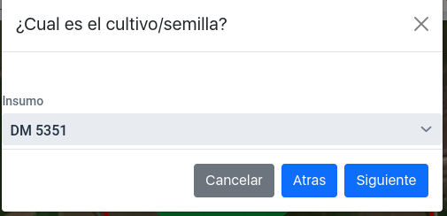
</p>

## Siembra - Etiqueta "Planificada"
Cuando la fecha de la actividad sea en el futuro, aparecera un tag/etiqueta diciendo "Planificada".

<p align="center">
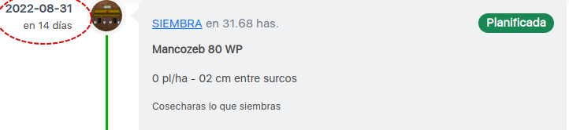
</p>

## Siembra - ComboBox 'Estado'
Cada actividad tiene un selector para que el usuario indique el estado de progreso de la 'Actividad'.

<p align="center">
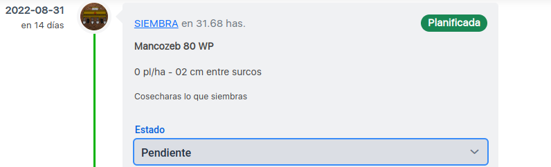
</p>

## Siembra - Botón 'Editar'
Ahora se pueden Editar las Actividades.

<p align="center">
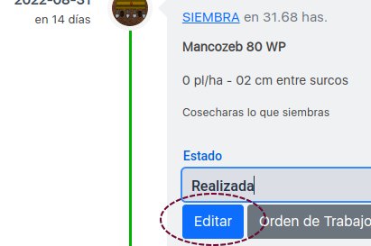
</p>

## Botones Condensados en el detalle de Lote.
En pantallas pequenas existian problemas en el renderizado de tantos botones. Ahora se condensan en un menú cuando la pantalla es pequeña.

<p align="center">
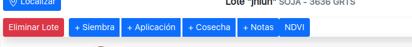
</p>
Pantalla 'Grande'


<p align="center">
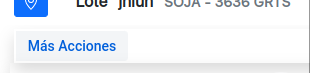
</p>
Pantalla 'Pequeña'

<p align="center">
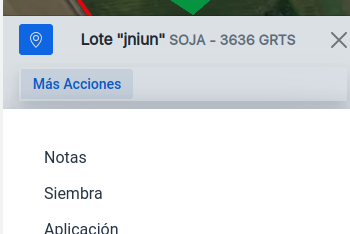
</p>
Pantalla 'Pequeña' - menu abierto.

* Trabajando en replicar los cambios para 'Aplicaciones' y 'Cosechas'.*


# Semana Anterior 2022-08-09

## Nueva estructura de 'Insumos'
La nueva estructura de los items de insumo permite, ademas de ver los detalles tradicionales (como nombre comercial, tipo, etc.), ver y establecer los parametros de margenes de dosis y estadios vegetales para los cuales se puede aplicar el producto.


```javascript
interface Insumo {
  _id: string,
  uuid: string;
  marca_comercial: string;
  principio_activo: string;
  tipo: string;
  subtipo: string;
  unidad: string;
  precio: number;
  se_aplica_a:  {       cultivo : any;
                        uuid: string;
                        estadio_desde: string;
                        estadio_hasta: string;
                        dosis_min: number;
                        dosis_max: number;
                        dosis_sugerida: number;
                };
  
}
```

En el futuro se puede utilizar la información de estadios vegetales para darle sugerencias al usuario de que productos puede aplicar basado en el desarrollo observado actual.

### Inicialización
El programa ya tiene cargado una lista de mas de 5000 insumos iniciales (obtenido de diversas fuentes) que el usuario puede extender o editar de ser necesario.

### Exportacion Excel
Es posible exportar una planilla de Excel con toda la información de insumos.


## Codigo Fuente al 20220816
**[Google Drive link '.zip'](https://drive.google.com/file/d/1VSlHESCeSUOPupG7fF79B4ZyZknPBHMn/view?usp=sharing)**