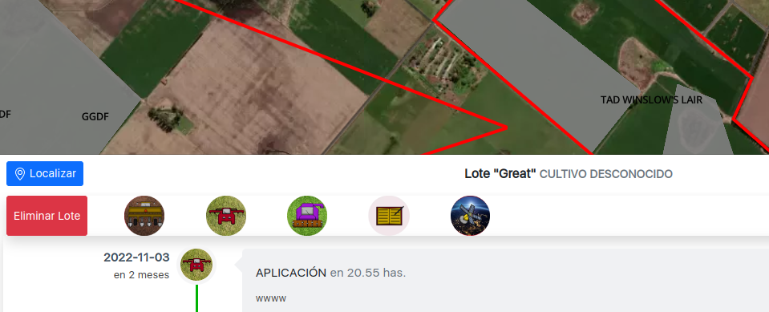
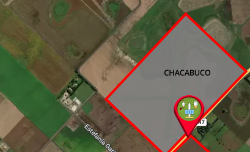
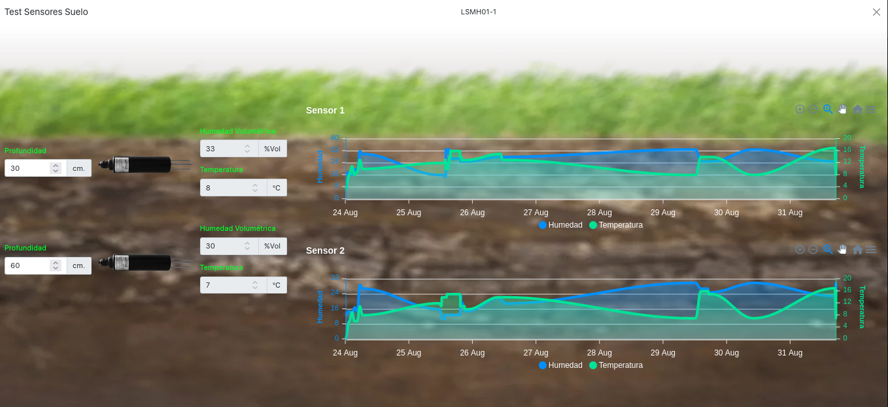
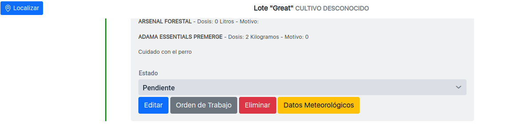
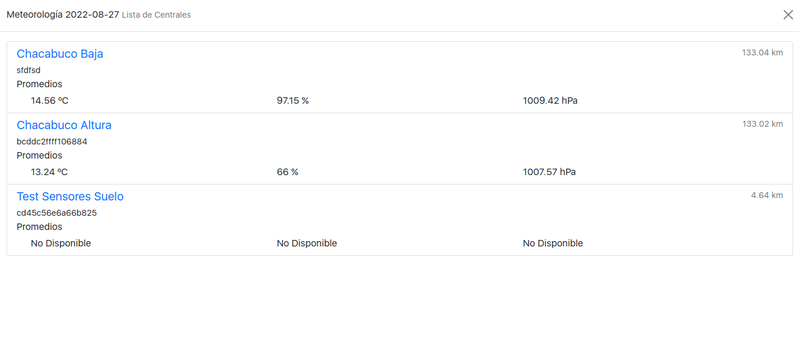
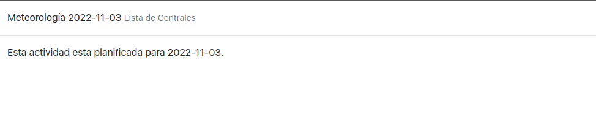
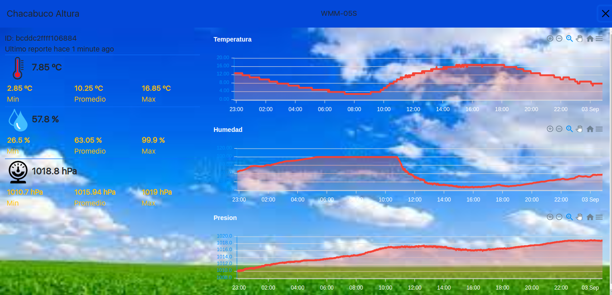

# Reporte de Cambios 2022-09-02

## Iconos en barra de navegación

 

## Iconos de actividades en el detalles de lotes
Los botones de "siembra", "aplicacion", etc. fueron reemplazados por los iconos provistos.

## Nombres en polígono de campo
Ahora sobre el mapa aparece el nombre del campo.

## Panel de Sensores de humedad
Nuevo Panel con los graficos e imagen de fondo.

## Datos Meteorológicos asociados a actividades
Cada actividad ahora tiene un botón donde se puede acceder a un listado de la centrales con los datos correspondientes
a la fecha consignada en la actividad y la distancia desde el campo a la central en cuestión.

En caso de tratarse de una actividad planificada, aparece un mensaje acorde. (En el futuro se puede mostrar el pronostico)

## Cambio en el panel de Centrales
Ahora los datos de las centrales usan iconos y muestra los gráficos con la imagen de fondo provista.

