# Reporte de Cambios 2022-09-10

## Lista de Dispositivos
En el menu de opciones->Lista de Dispositivos se accede a una lista para llegar a los dispositivos si necesidad de buscarlos manualmente.

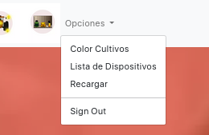

 

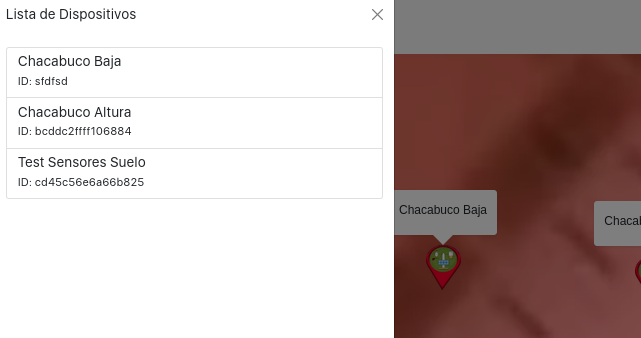

 

## Etiqueta y Zoom al dispositivo para evitar clickear en el equivocado
Cuando se clickea en la lista el programa va a hacer zoom sobre el marcador.
Ademas ahora tienen una etiqueta con el nombre.

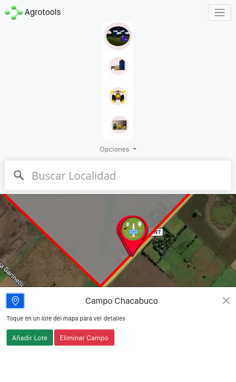

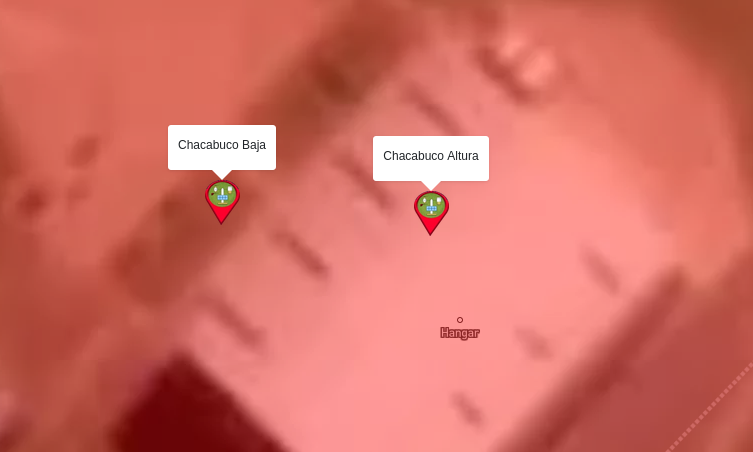

## Alineación Datos Numéricos + Gráfico en una sola fila
En pantallas grandes los datos y los graficos ahora forman una sola fila para evitar "distorsion" si se encuentran en columnas diferentes.

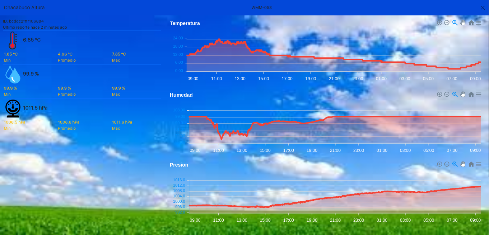

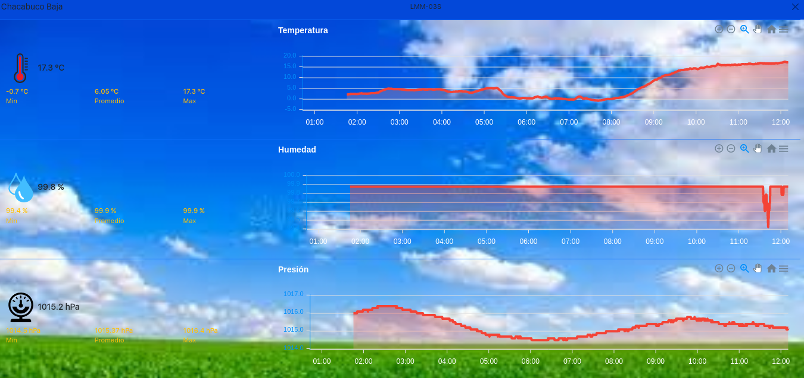

## Cambio en diseño para pequenas pantallas
En una pantalla pequeña inicialmente solo se muestran los datos numéricos y aparece un botón para cambiar entre el grafico y los datos.

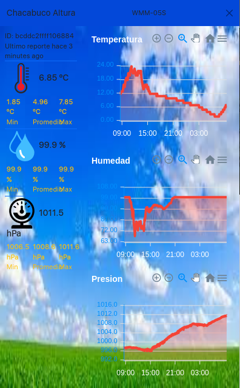

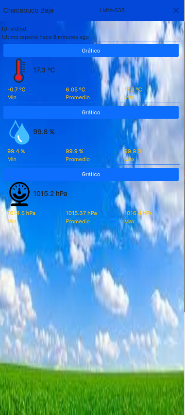

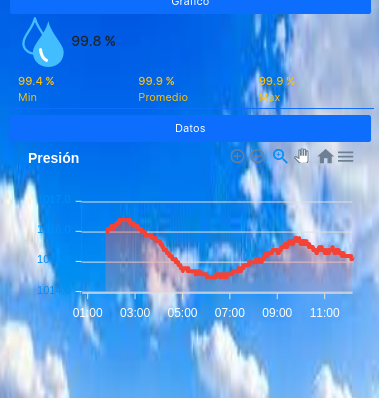

Lo mismo para el caso de los sensores de humedad.

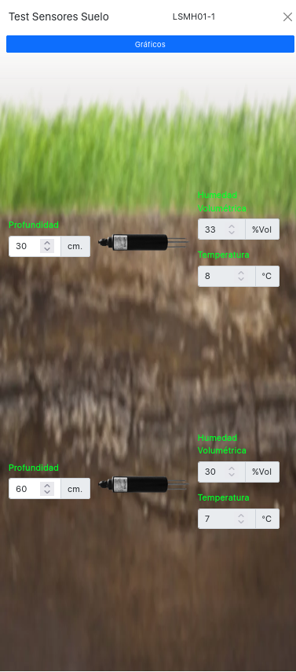

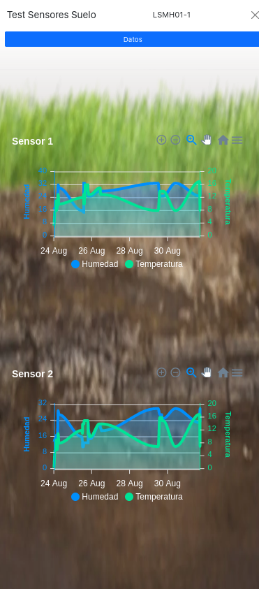

## Colapso de la navbar en pequeñas pantallas al hacer click en cualquier botón
Ahora en celular, la barra de navegación colapsa cuando se toca un botón evitando tener que cerrarla manualmente.