# Reporte de Cambios 2022-09-19

## Exportación Gráficos -> Excel

Sobre cada gráfico, en el menu hay una opcion "Download XLS" que descarga la serie del gráfico correspondiente en formato "XLS".

### Botón de descarga

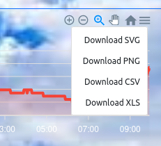

### Archivo XLS

## NDVI - Cambio de formato y ubicación de la ventana.

La ventana de NDVI ahora aparece en la izquierda con un nuevo formato de las tarjetas de observaciones. Antes estaba en el sector inferior.

### Vista general

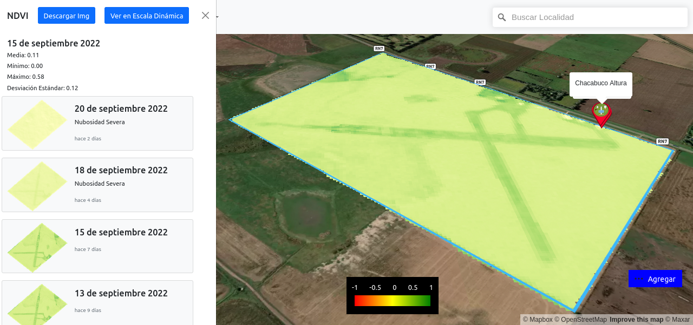

### Detalle de la observación seleccionada

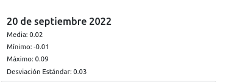

### Tarjetas con indicación de nubosidad si correspondiere.

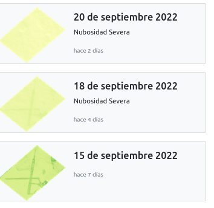

## NDVI - Nueva escala con rango dinamico min-max.

Se puede elegir ver las imagenes en la escala tradicional que mapea ROJO-AMARILLO-VERDE -> -1..0..1 o en la escala dinámica que va desde AZUL-ROJO-VERDE -> mínimo valor de NDVI...máximo valor de NDVI (para esa observación).

### Botones selectores de escala:

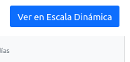

 

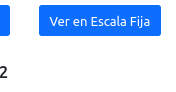

### Ej: Escala Fija

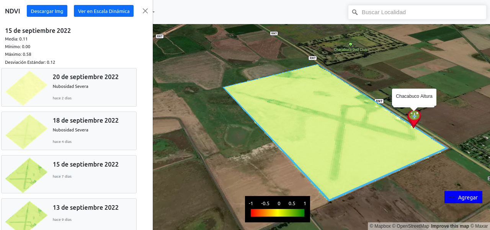

### Ej: Escala Dínamica

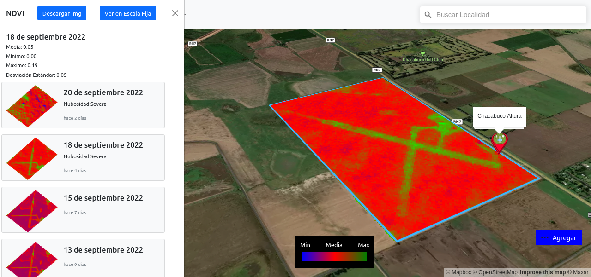

## NDVI - Leyenda de Color.

Ahora existe una leyenda de color para cada escala.

### Escala Fija

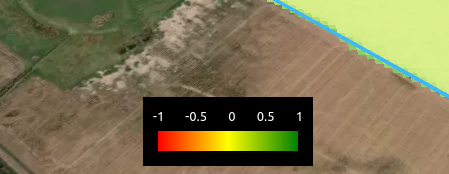

### Escala Dinámica

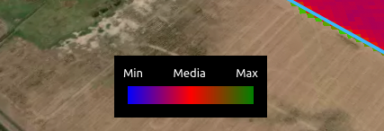

## NDVI - Descarga de la imagen NDVI.

Se puede tambien descargar la imagen NDVI que se esta visualizando en formato PNG mediante el botón ubicado en el borde superior.

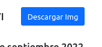

