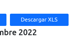
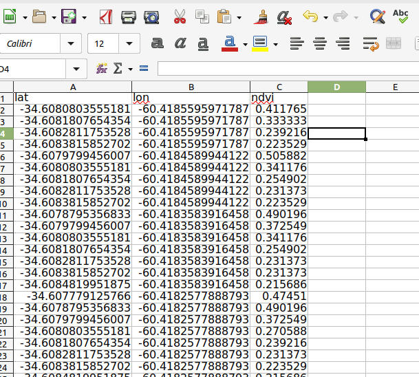
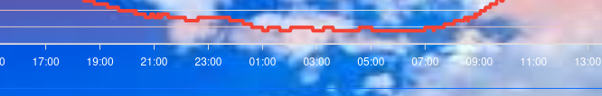
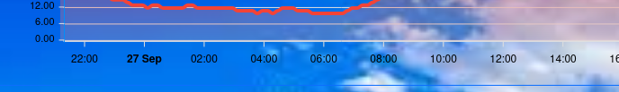
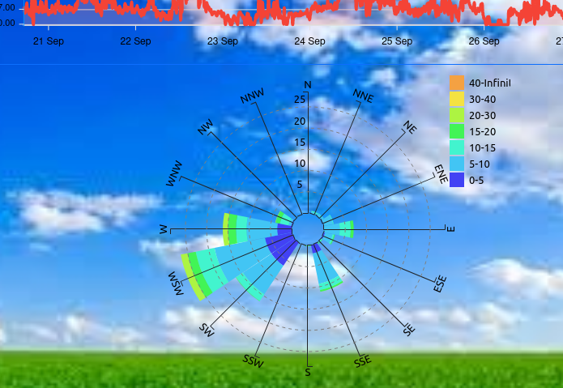

# Reporte de Cambios 2022-09-26

## NDVI - Valor Puntual

Cuando el mouse se posiciona sobre la imagen, un popup muestra el valor de NDVI bajo el cursor.

## NDVI - Exportación a Excel
Se pueden exportar los valores en un archivo xls que incluyen "latitud", "longitud", "NDVI" de cada pixel. Se incluyen todos los valores con NDVI > -1.

## Graficos - Cambio de color de Etiquetas a Negro

## Graficos - Radar / Rosa de los Vientos
Ahora el gráfico de dirección es un radar/rosa de vientos que muestra la direcciones, velocidades y frecuencias principales del viento.

