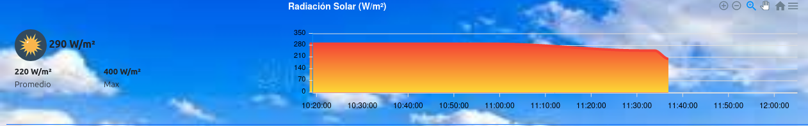

# Reporte de Cambios 2022-10-06 (Version 0.1.54)

## Agregado número de Versión
El último elemento del menú opciones es el número de la actual versión.

## Gradiente de color en lineas de gráficos

## Tarjeta y Gráfico Radiación Solar con gradiente de color

## NDVI - Histograma
