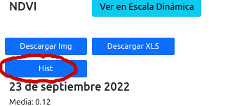
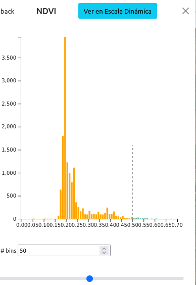
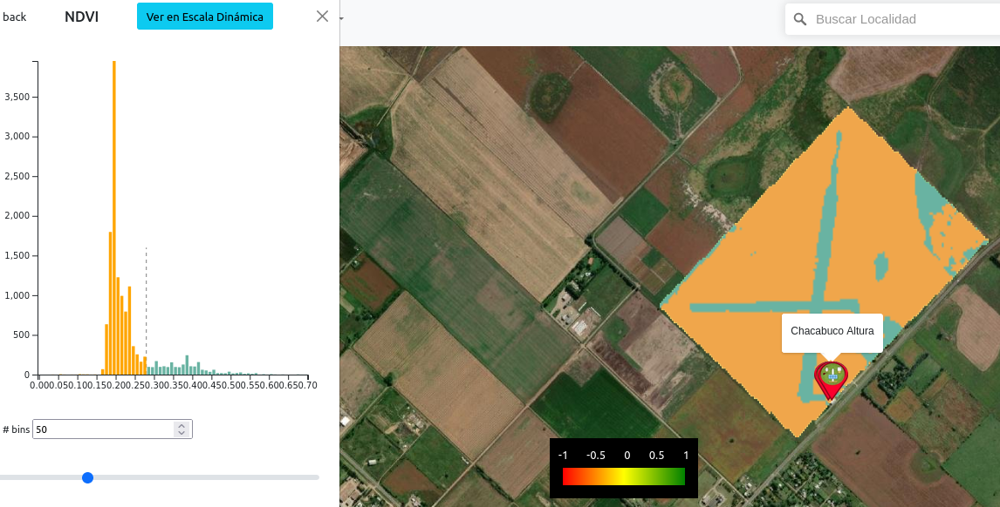

# Reporte de Cambios 2022-10-06 (Version 0.1.54)

## Agregado número de Versión
El último elemento del menú opciones es el número de la actual versión.

## Tarjeta y Gráfico Radiación Solar con gradiente de color

## NDVI - Histograma
NDVI ahora tiene un histograma que se va a usar (pronto) para crear ambientes para generar mapa de ambientación.

Tiene un control que permite controlar la cantidad de particiones.

