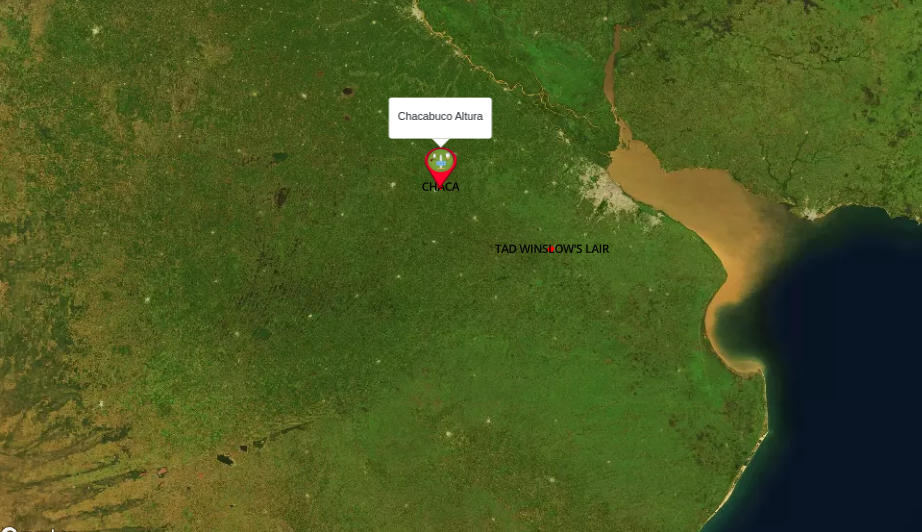
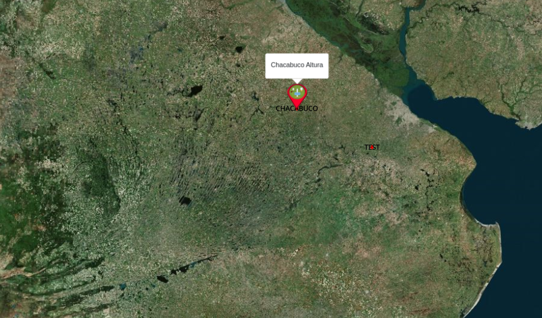
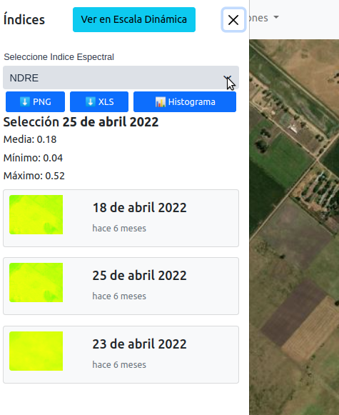
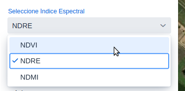
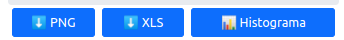
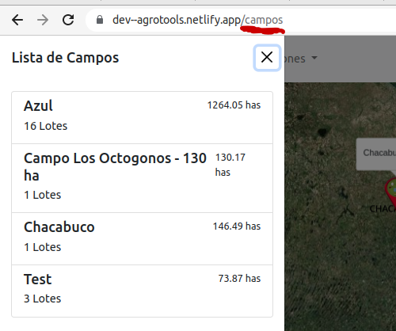

# Reporte de Cambios 2022-10-19 (Version 0.1.55)

## Nuevo Mapa Base
El mapa base cambia a uno de Microsoft de mayor definición y contraste entre diferentes superficies (cuerpos de agua, relieve, etc):

**Antes:**
<p align="center">

</p>

**Ahora:**
<p align="center">

</p>


---

## NDVI -> Nuevos Índices Espectrales
La sección de NDVI ahora se llama "Índices" y va a mostrar otros indices espectrales ademas del NDVI.

<p align="center">

</p>

En un ComboBox se pueden seleccionar los índices espectrales usando las bandas del ***Sentinel 2***:

<p align="center">

</p>

- *NDVI* `(Banda B08 - Banda B04)/(Banda B08 + Banda B04)` 
- *NDRE* Diferencia Normalizada del Borde Rojo. `(B08-B05)/(B08+B05)`
- *NDMI* Índice de Humedad de Diferencia Normalizada. `(B08-B11)/(B08+B11)`


Próximamente:
- *ReCL* Índice de clorofila de borde rojo.
- *MSAVI* Índice de Vegetación Ajustado al Suelo Modificado.


Los botones de la sección ahora tienen iconos:
<p align="center">

</p>

---

## "Client Side" Routing 
Ahora es posible acceder a algunas (iré agregando mas) secciones del sitio directamente usando URLs mediante ruteador que funciona en el navegador y permite cargar componentes específicos sin recargar la pagina desde el server.

Es util para que el usuario pueda agregar marcadores de secciones especificas (eventualmente compartir?).

También sirve para que en el uso en celular el botón 'BACK' devuelva a la vista anterior como en una app nativa

<p align="center">

</p>

URL's por ahora:
```
/campos -> lista de campos
/indices/{uuid del lote} -> sección de índices.
```
