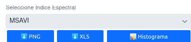
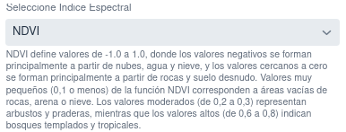
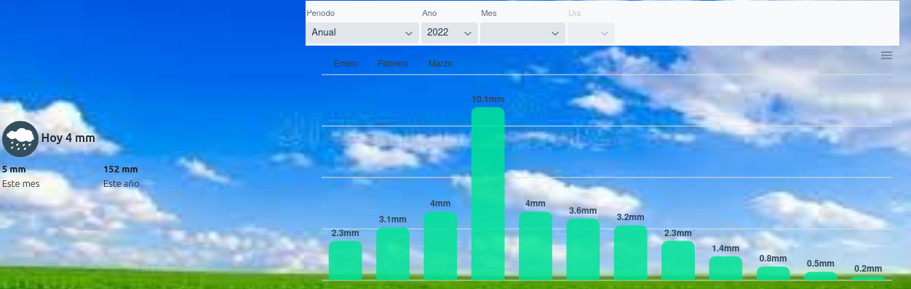
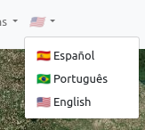
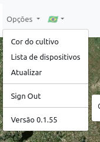
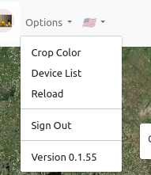

# Reporte de Cambios 2022-10-31 (Version 0.1.56)

## Mas Indices

- **MSAVI** Índice de Vegetación Ajustado al Suelo Modificado.

## Texto explicativo para cada indice

## Visualización de Pluviómetro
Agregado gráfico para visualizar los datos del pluviómetro. Tiene unos selectores que van a permitir seleccionar el periodo de resumen (año,mes,dia).
En la tarjeta de la izquierda de muestran el acumulado del dia, del corriente mes, y del corriente año.

## Soporte para Internacionalización
En la navbar ahora hay un control que permite seleccionar el idioma de la app entre Español, Inglés, Portugués.
(por ahora solo traduje los elementos del menú "Opciones" como demo.)

---