# Reporte de Cambios 2022-11-25 (Version 0.1.58)

## Multiuser - Espacios de Trabajo (Workspaces) (**en progreso al 28/11/22**)
Para que el usuario tenga una forma de agrupar campos, contratistas, depos, etc. de manera que le ayude a mantener separados distintas entidades (ej "sociedades") y a la vez tener una forma simple (para el usuario) de compartir datos, agregamos el concepto de "espacio de trabajo".

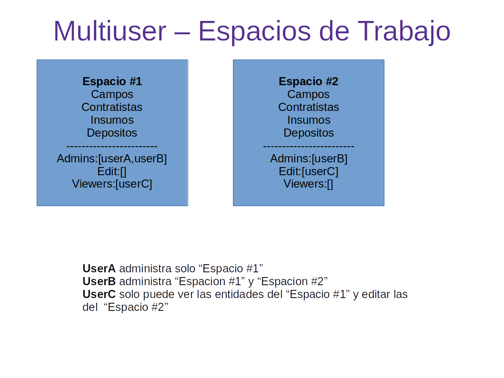

Un "Espacio de Trabajo" es un conjunto de Campos, Depositos, Contratistas e Insumos que puede o no ser compartido a otro usuario de la plataforma con tres niveles de autorización:
- Admin: Puede Agregar, editar y borrar todas las entidades del espacio de trabajo y ademas puede administrar permisos/compartir. El usuario que crea un espacio de trabajo es por default uno de sus admins.
- Editor: Puede Agregar, editar y borrar todas las entidades del espacio de trabajo, pero no puede administrar permisos ni compartir ese espacio a otros usuarios.
- Visor: Solo puede visualizar pero no puede realizar modificaciones.

Un usuario puede tener multiples espacios de trabajo.

***Menú de espacios de trabajo***

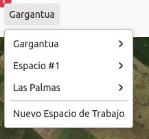

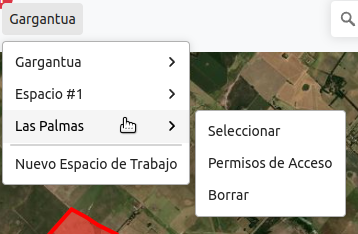

Si se selecciona "Permisos de Acceso" se abre la ventana

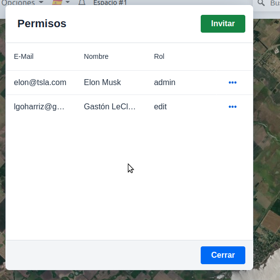

Para compartir un espacio de trabajo es necesario enviar el link de invitación al usuario al cual deseamos compartir. Para eso el usuario clickea en "Invitar" y se abre una ventana requiriendo un email, un nombre con el que va a ser referenciado por el usuario, y el nivel de permisos.

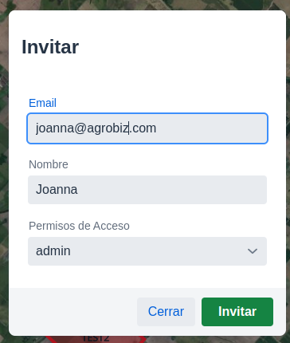

Cuando el usuario objetivo abre el link puede aceptar o rechazar.
Si acepta aparecerá en su lista de "espacios de trabajo"

El usuario tambien puede editar los permisos que asigno (si se trata de un admin para ese "Espacio") haciendo click en los tres puntos

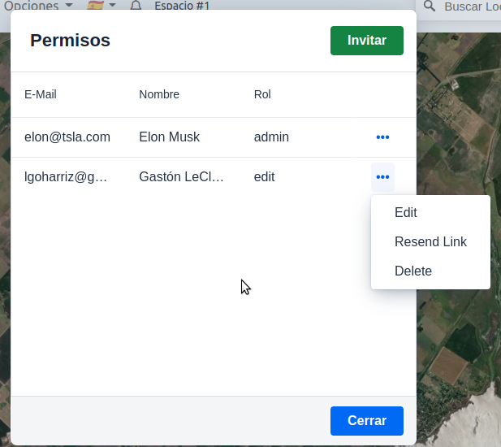

### Creación de Espacios de Trabajo
Por defecto cada usuario tiene creado un espacio de trabajo al momento de abrir la cuenta. Si lo desea puede crear otros haciendo click en "Nuevo Espacio..".

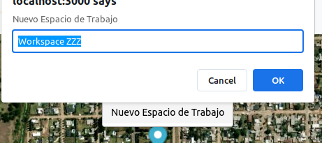

---

## Fit Zoom cuando se clickea un Campo

Al clickear en un campo de la lista se ajusta el zoom para que los limites del campo queden dentro de la pantalla.

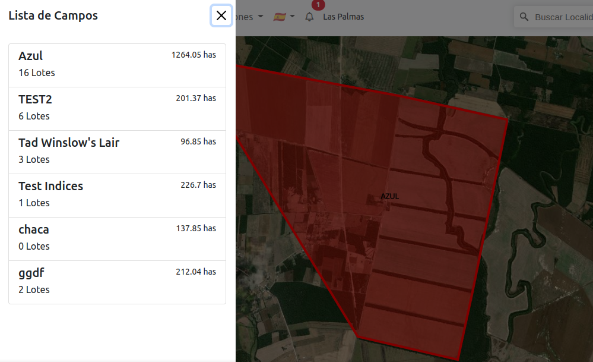

---

### Anteriormente

## Notificación de Próxima Visita
Las Notas tienen ahora un campo de "Proxima Visita".
Cuando la fecha se encuentra dentro de la proxima semana se notifica al usuario mediante un icono de campanita en la barra de navegación.

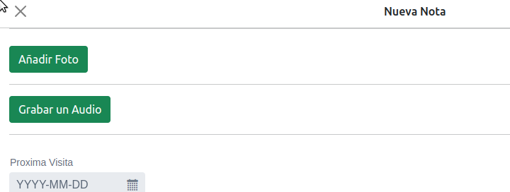

***Icono de notificación en la barra***

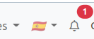

***Notificación Abierta***

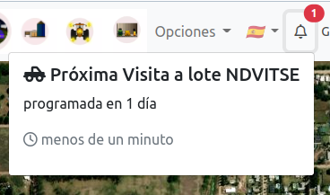

Al hacer click en la notificación se abre el lote en cuestión.

## Mejoras En Indices
Carga Parcial de 5 muestras por vez. El usuario puede requerir mas haciendo click en el botón.

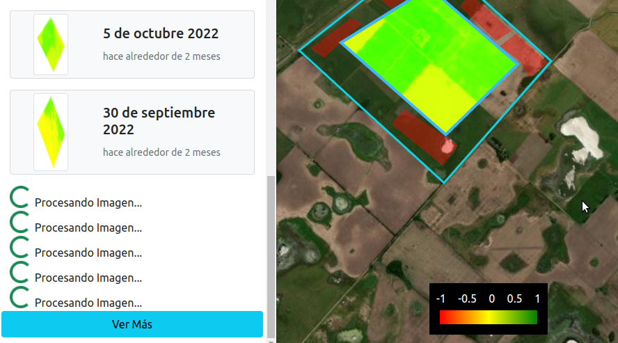

---
