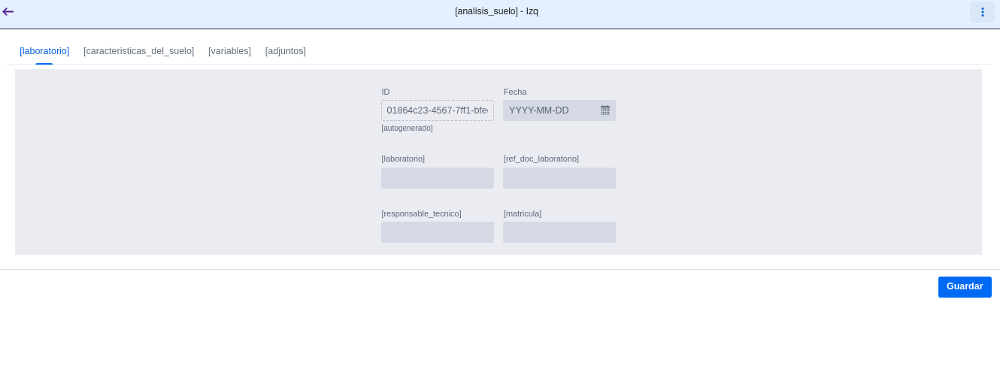
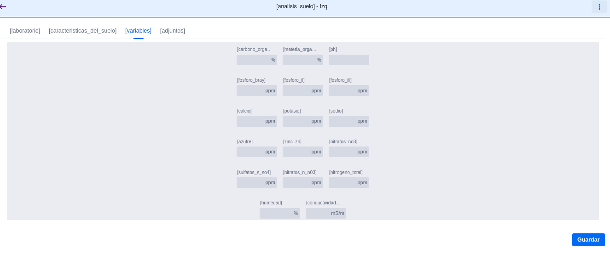
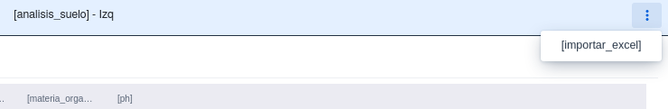
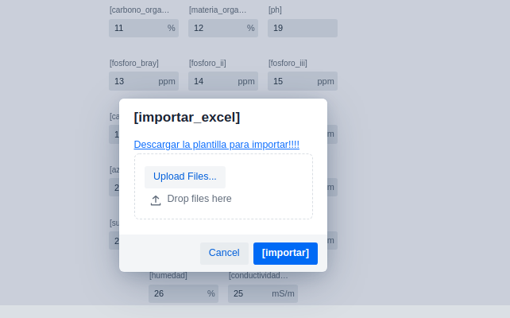
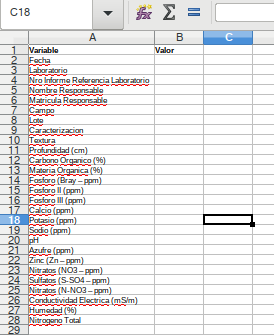
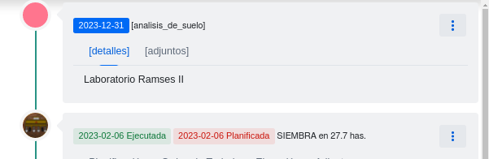

# Reporte de Cambios 2023-02-13 (Version 0.1.64)

## Analisis de Suelo
El el offcanvas del lote, en la barra de herramientas se  agregó un menu que contiene la opcion "Analisis de Suelo"

Se accede a una ventana que tiene 4 pestañas:

- ***Laboratorio*** - Con los datos de laboratorio y resposable
- ***Caracterizacion*** - Con la caracteristicas del suelo
- ***Variables*** - Con todas la variables listadas en en .doc
- ***Adjuntos***

El el botón sup derecho se puede acceder a la importacion de todos los campos mediante un archivo excel:

Desde el mismo, tambien se puede descargar el template para la importación:

El la linea de tiempo aparecera un item indicando "analisis de suelo" (Va a tener un icono!!!!! y mas detalles. Se pueden ver los valores en menu->editar)

**Sigo trabajando en agregar rangos de variables**

## Autoseleccion de central
Al seleccionar la fecha/hora de finalizacion al ejecutar una tarea, se autoselecciona la central mas cercana.