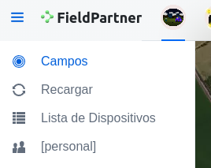
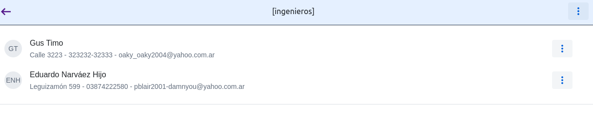
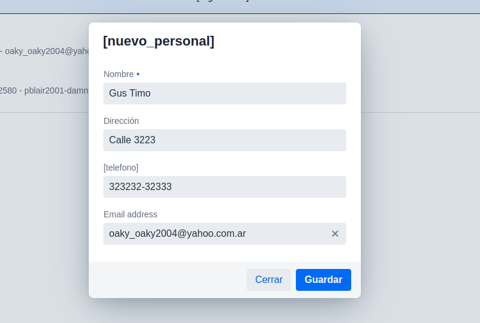
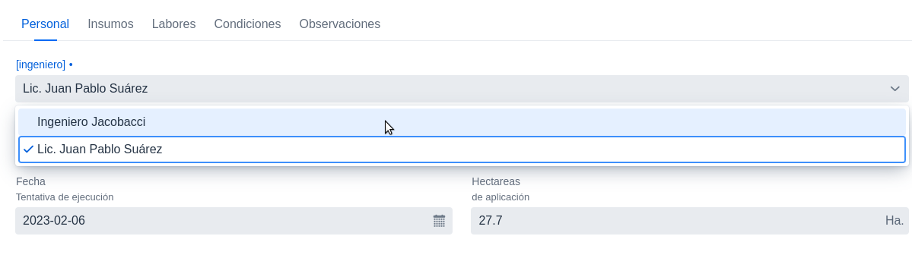
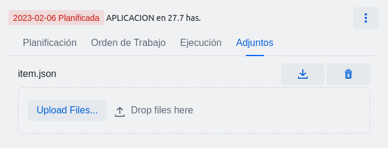
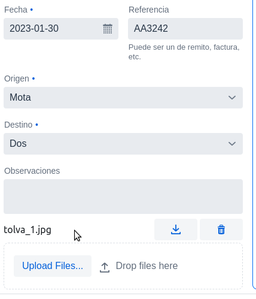
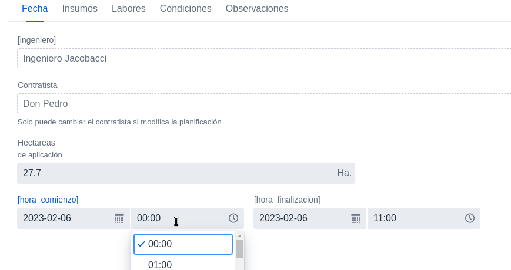
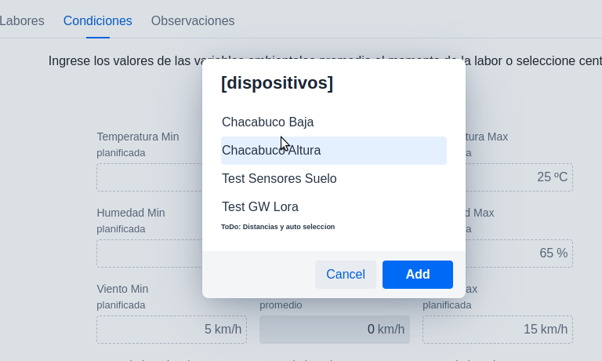
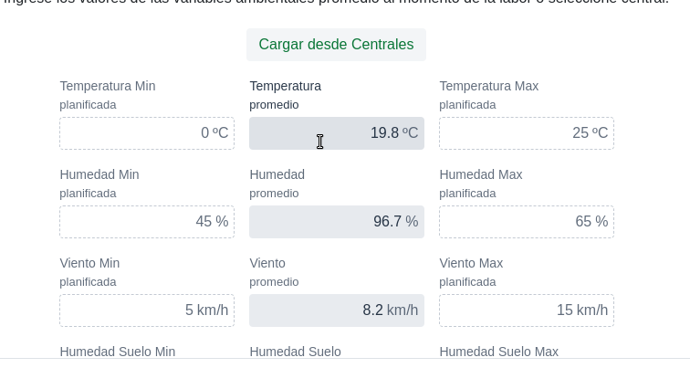
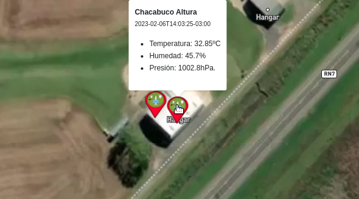

# Reporte de Cambios 2023-02-06 (Version 0.1.64)

## Personal/Ingenieros
En en cajon lateral se agrego el item "Personal".
El la primer ventana se listan los nombres y datos de contacto.
El la esq sup derecha se pueden agregar nuevos items.

Listado

Editor

Por ahora los items creados aqui lo utilizamos para el campo "Ingeniero" que fue agregado a las actividades de APLICACION.

## Adjuntos
En la pestaña "Adjuntos" de cada item de actividad ya se se pueden adjuntar archivos.

Idem en el editor de transferencias:

## Hora inicio y fin en ejecucion de Actividades

Se puede seleccionar la hora de inicio y fin de la ejecucion.

## Seleccion de central y promedio de datos

Usando el rango de tiempo se calculan los promedios de la central seleccionada y se cargan en el formulario.

***En progreso: Autoseleccion y ordenamientos de distancias. Selector diferenciado de sensor humedad suelo***

## Popup sobre centrales al pasar el mouse con los ultimos datos.
Se muestran Temp, Hum, y Presion para tener lectura rapida.

