# Reporte de Cambios 2022-01-08 (Version 0.1.62)

### Detalles de insumos en los items del ComboBox.

Cada item de la lista de insumos muestra (segun se encuentren completados para cada insumo):

- Nombre Comercial
- Principio Activo
- Pildora coloreada con "tipo-subtipo"
- Pildora coloreada con cada cultivo de la lista "Se aplica a"

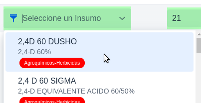

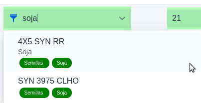

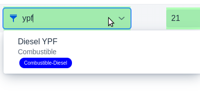

### Filtrado de insumos en pantallas de Añadir/Editar Actividades

#### **Filtro 1:** Botón de filtrado de categorias.

- Para filtrar y limitar los insumos visibles se añadio un botón con el ícono de filtro en el ComboBox selector de insumo en donde se listan las distintas categorias de los mismos.

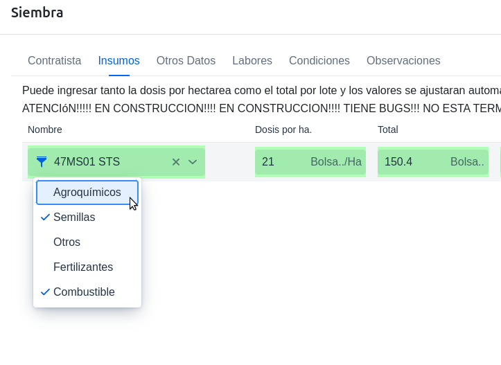

- Por defecto se seleccionan algunas categorias de acuerdo al tipo de actividad en cuestion:
	- Siembra -> "Semillas", "Combustibles"
	- Aplicacion -> "Agroquimicos", "Fertilizantes", "Combustible"
	- Cosecha -> "Otros", "Combustible"

Independientemente de las categorias seleccionadas por defecto el usuario puede seleccionar/deseleccionar categorias a discrecion.

#### **Filtro 2:** String ingresado por el usuario.

- El fitro 2 opera sobre los insumos que pasan el filtro 1 (categorias seleccionadas).
- El filtro reduce la lista de insumos que cumplen alguna de las siguientes condiciones:
	- El string forma parte del nombre comercial.
	- El string forma parte del principio activo.
	- El string forma parte del alguno de los nombres de los cultivos especificados en la lista de "se aplica a" que corresponde a ese insumo.

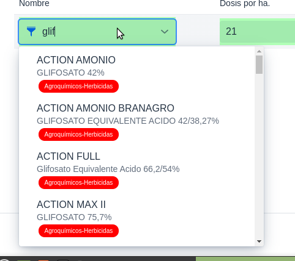

Ej. de busqueda por principio Activo

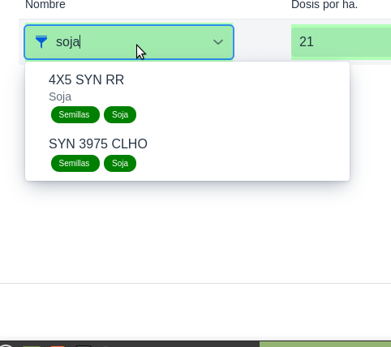

Ej. de busqueda por cultivo

### Chequeos al crear o editar planificaciones.

Se realizan los siguientes chequeos antes de guardar la **planificación** de una actividad:

- Para todos los tipos: 
	- Fecha tentativa de ejecución dentro de la campaña.
	- Debe seleccionar un contratista.
	- Debe seleccionar un al menos insumo.
- Siembra:
  - Debe seleccionar al menos un insumo de semilla
  - Debe ingresar una labor de 'Siembra'
- Cosecha:
  - Debe ingresar una labor de 'Cosecha'

### Chequeos al crear o editar ejecuciones.

Se realizan los siguientes chequeos antes de guardar la *ejecución* de una actividad:

- Para todos los tipos: 
  - Fecha de ejecución posterior o igual a la planificación y dentro de la campaña.
  - Debe seleccionar un al menos insumo.
- Siembra:
  - Debe seleccionar al menos un insumo de semilla
  - Debe ingresar una labor de 'Siembra'
- Cosecha:
  - Debe ingresar una labor de 'Cosecha'

## Campañas
Se añadio el concepto de "Campañas". Mediante un menu en la barra se puede crear, seleccionar y editar.

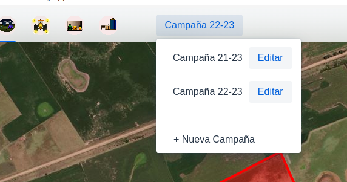

Selector de Campaña

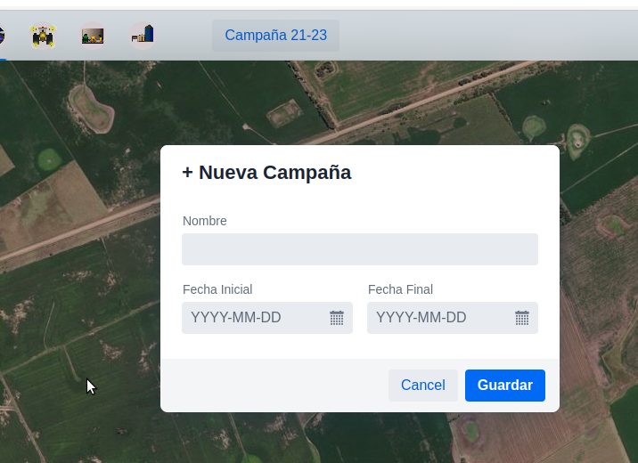

Nueva Campaña

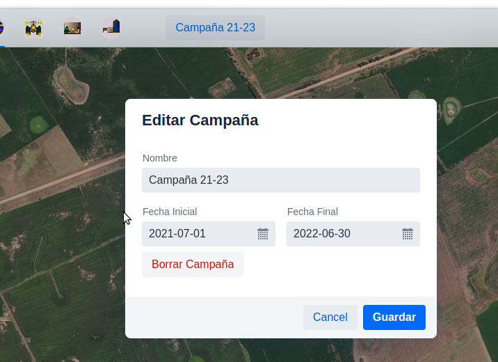

Editar Campaña, con el botón de "Borrar Campaña"

Seleccionar la campaña permite filtrar los datos y limitarlos al periodo de tiempo de la misma.
Los items mostrados en la linea de tiempo son filtrado por el periodo y los selectores de fechas de las actividades limitan el rango de acuerdo a la campaña seleccionada.
Va a ser utilizado especialmente a la hora de hacer informes.

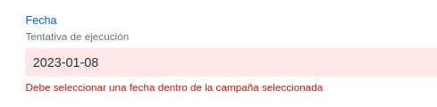

Error mostrado al ingresar una fecha invalida con el teclado

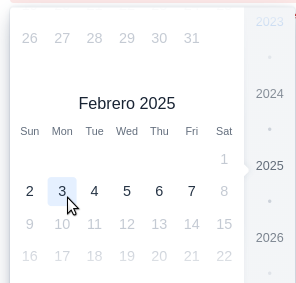

Ejemplo de campaña de una semana y como se ve en los selectores

- **Importante** En la implementación actual las campañas no ***contienen*** a los datos solo son un mecanismo de filtrado de los mismos por un intervalo de fechas. Esto implica que al borrar una campaña no se eliminan los datos (actividades, notas, etc.). Una actividad (o cualquier otro dato fechado) pertenece a una campaña en virtud de su fecha solamente no existiendo una relación explicita. 

### Chequeos al crear una campaña

- Nombre no vacio
- Fechas deben ser asignadas
- Fecha fin > Fecha inicio
- Fechas que no solapen con campañas ya definidas.
  
  Al no cumplirse alguna de estas reglas se muestra un alert notificando.

## Lista de insumos - Filtro de busqueda rapida y otros.

En la lista de insumos se realizaron los siguienes cambios:

- Caja de busqueda para filtrado rapido. El filtro devuelve los insumos en donde:
	-- El string forma parte del nombre comercial.
	-- El string forma parte del principio activo.
	-- El string forma parte del alguno de los nombres de los cultivos especificados en la lista de "se aplica a" que corresponde a ese insumo.

- Columnas con botones de reordenamiento ascendente/descendente.

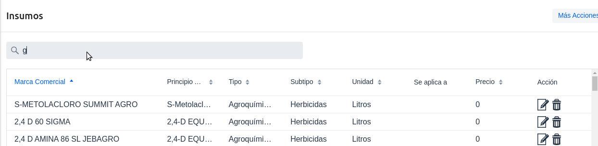

Editar Campaña, con el botón de "Borrar Campaña"

## Cambio de posición botón de lenguaje y "Log Out".

- De acuerdo a lo señalado el 20220104, se añadió un botón selector de lenguaje en la esquina sup. derecha, en la barra de navegación y se eliminó el ComboBox en el cajon izquierdo.
- El botón de "LogOut" se desplazo hacia abajo del cajón.

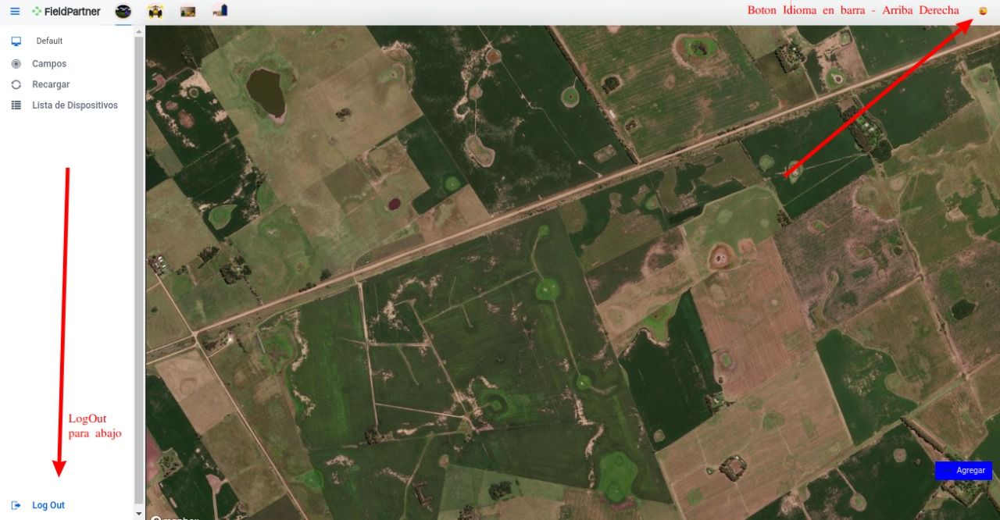

## Indicador de Versión

- El indicador de versión se elimino de cajón izquierdo para que no ocupe lugar.
- Se puede visualizar la version actual pasando el puntero del mouse sobre el la imagen del logo en la barra de navegación.

### Codigo y Estadisticas

Zip con todo el codigo de la app (frontend):
https://drive.google.com/file/d/1ZXMjRBfSu522cosYLbrcTvZPjLvPRGyZ/view?usp=sharing

#### Estadisticas de código
Archivos (main code): 120
Lineas de código: 27606

---

### Sigo trabajando en:

- Incluir "Motivos" en las notas.
- Facilitar la creación de una aplicación partiendo de una nota autocompletando los "Motivos".
- Adjuntar cualquier archivo a las notas y a las actividades en gral.
- Extraccion de condiciones en ejecución.
- Depositos.
- Transferencias entre depositos/contratistas.

---
---
### Cambios Anteriores

#### Notas - Ubicación por Defecto a Mapa

- Cuando se abre una nueva nota, la ubicacion por defecto se cambio por el mapa en vez del dispositivo para evitar desplazamientos si el usuario no esta en el lote en cuestion.

#### Orden de Trabajo 'Interpuesta' entre "Planificacion" y "Ejecución"

- Para "Ejecutar" es necesario generar al menos una vez la orden de trabajo.

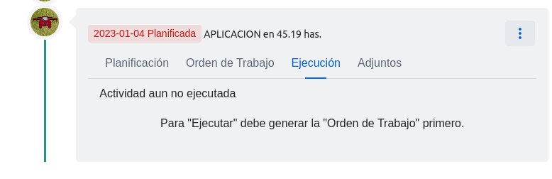

#### Informe PDF de comparación entre Planificación y Ejecución

- En el menú de item de linea de tiempo (tarjeta de actividad, esquina superior derecha) se añadio un botón "Ejecución vs Planificación PDF" que abre un PDF mostrando las tablas de insumos de planificación/ejecución.
  

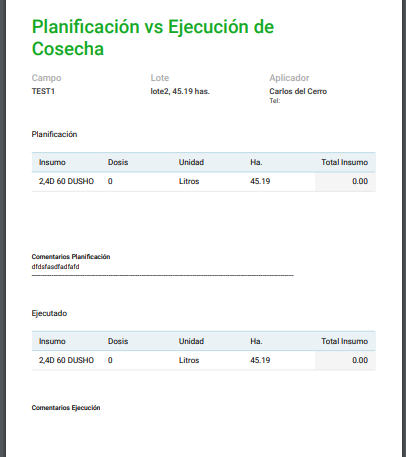

#### Cambio de "Agrotools" -> "FieldPartner"

- Se cambiaron todas las referencias al string "Agrotools" por "FieldPartner"
- No deberia quedar ninguna referencia a Agrotools.

#### Cambios en Barra/Menú de Navegación
- Se modifico el layout de navegación principal dejando solo el logo y los botones principales en la barra de navegación y moviendo el resto a un cajon accessible via el boton arriba a la izquierda.

#### Iconos (**Eliminado tras reunión 2023-01-04 -> Posición de Iconos y selector de idioma**)
- Se modificaron los iconos provistos quitandoles los fondos blancos y pasandolos a transparentes.
- Se unificaron la dimensiones de los mismos.

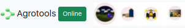

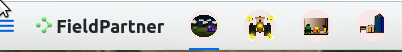

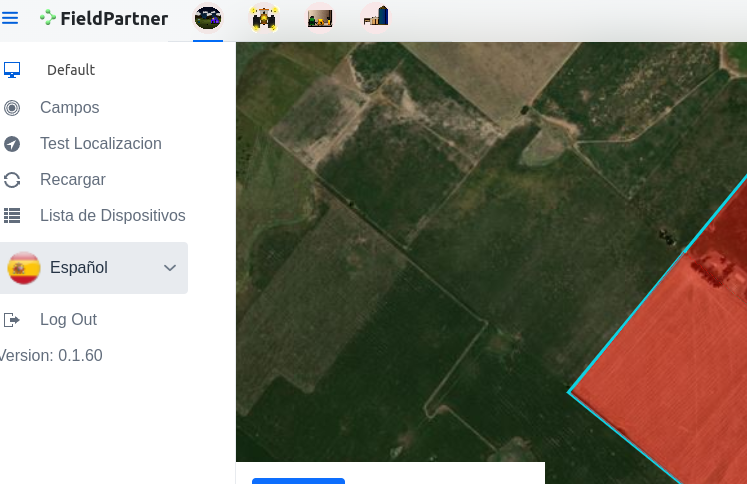

#### Detección IP/Localización (**Eliminado tras reunión 2023-01-04 -> "Dejarlo para despues"**)

- Partiendo de los comentarios del reporte [https://staging--agrotools.netlify.app/reportes/rgallardo/20221229.pdf] y a modo de prueba, en el menú se añadio un item llamado "Test Localización" realiza un request a un endpoint creado especialmente en el sitio (ej https://dev--agrotools.netlify.app/geolocation) que devuelve la localización basado en la IP de origen del request.
En la app se imprime un alert con la respuesta de este endpoint.

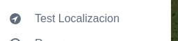

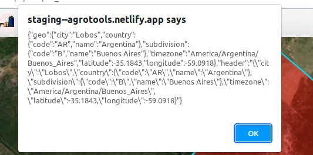

