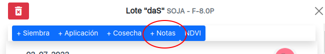
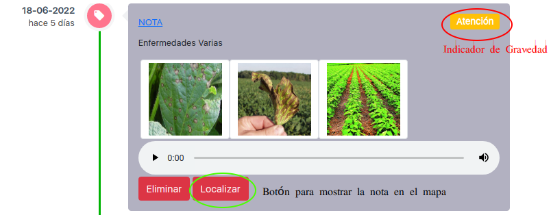
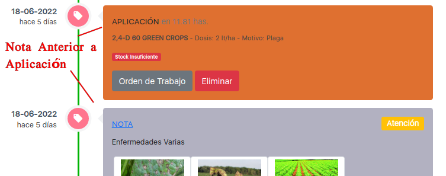
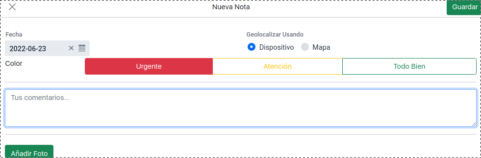
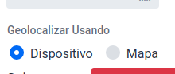
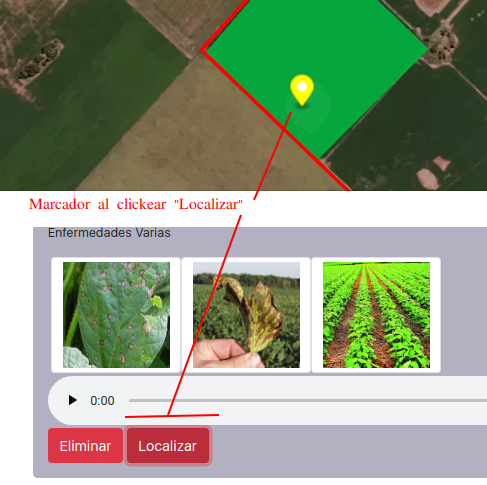
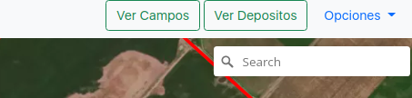
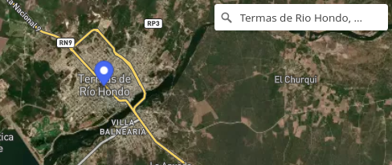

# Reporte de Cambios 200622

## Notas
Ahora las "Notas" forman parte de las actividades del lote y aparecen en la linea de tiempo del mismo:

Ejemplo tarjeta "Nota":

Las Notas se pueden ingresar antes de realizar otra actividad:

***

### Localización de nota 

Cuando se agrega una nota nueva se pueden seleccionar una de dos opciones:

Opcion "Dispositivo": Utiliza la geolocalizacion del dispositivo (el navegador solicita permiso).

Opcion "Mapa": Se puede designar la ubicación haciendo click en el mapa.

***

### Buscador de localidades

Ahora el mapa sobre la esquina sup. derecha (PC) tiene una caja de texto para buscar localidades.

