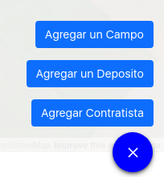
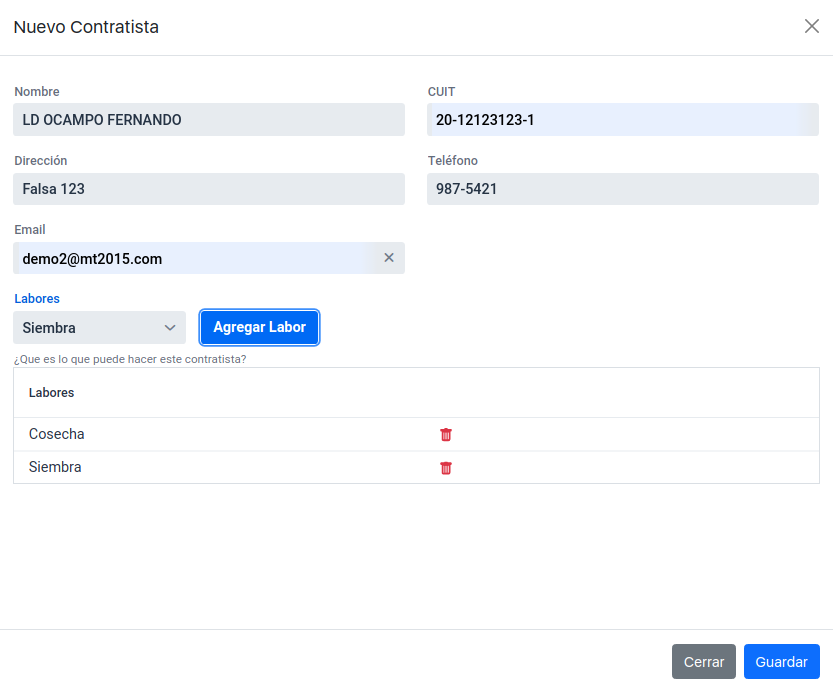
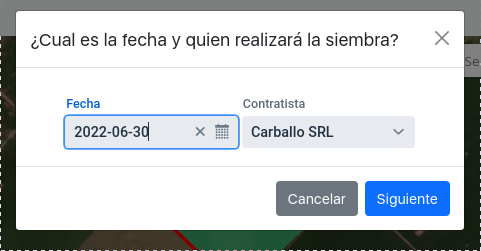
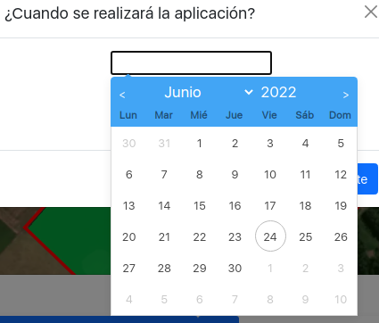
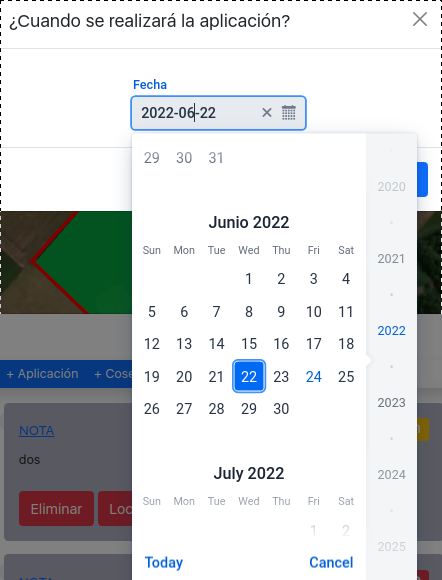
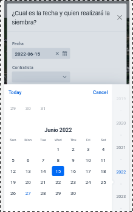
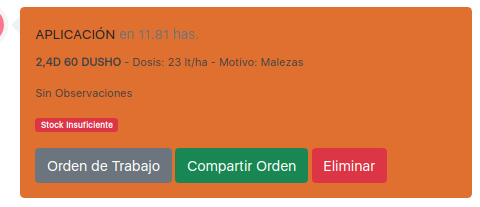
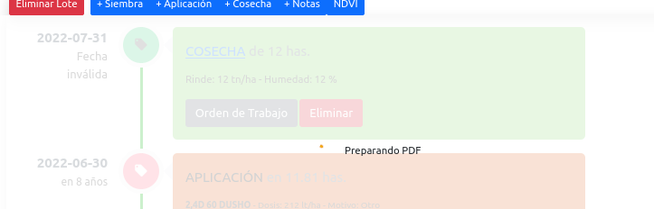

# Reporte de Cambios 2022-06-27

## Contratistas
Se incorpora el concepto de "Contratista".

Cada contratista puede realizar ciertas "Labores" (siembra-cosecha-etc). 
Las "Labores" se utilizaran en el futuro (no implementado aún) para filtrar que contratistas tienen la capacidad de realizar una determinada "Actividad"

### Formulario "Nuevo Contratista"

Cuando se agrega una nueva "Actividad" el usuario puede seleccionar el contratista.

***

## Nuevo Selector de Fecha
Fueron modificados los selectores de fecha para que tengan el mismo funcionamiento tanto en la PC como en el celular. Previamente en los telefonos, el navegador reemplazaba con su propio selector.

*Antiguo Selector*

*Nuevo Selector (PC)*

*Nuevo Selector (Celular)*

***

## Boton de Descargar Orden Siempre Presente

Ahora el Boton de Descarga de la "Orden de Trabajo" esta siempre presente, incluso en dispositivos que tengan la capacidad de compartir.

***

## Indicación al Usuario "Preparando PDF"

En el celular la creacion de PDF puede llevar algun tiempo. Cuando el usuario toca "Orden de Trabajo" un spinner aparecera como indicación

