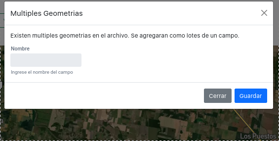
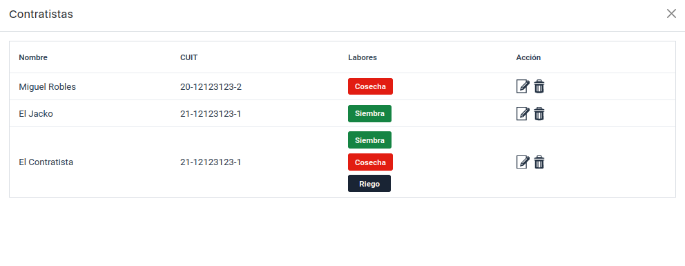
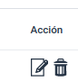
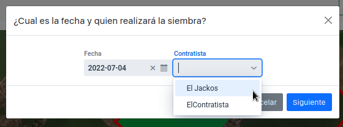

# Reporte de Cambios 2022-07-03

## Multiples lotes

Ahora se pueden utilizar archivos que contegan multiples polígonos al agregar un campo.

- Cada geometria se considera y asume como un lote.
- El perimetro del campo se determina (por ahora) calculando la envolvente convexa de los lotes.
- **ToDo**: Encontrar un algoritmo para calcular un poligono envolvente de poligonos discontinuos. 

## Lista de Contratistas

### Boton "Contratistas"

En la barra de navegación ahora hay un botón para ver contratistas.

### Lista de contratistas

El usuario puede ver y administrar (editar, borrar) a cada contratista a traves de la lista de contratistas.

Acciones

## Filtrado de Contratistas por Siembra y Cosecha

En Siembra y Cosecha solo se listan contratistas que tengan esas actividades listadas en su lista de labores

## Compartir audio de Whatsapp

Se puede compartir con la app un Audio Recibido en Whatsapp y tomarlo como el audio de una nota.

