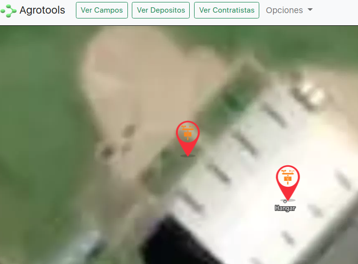
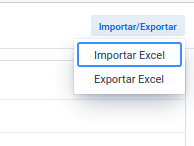

# Reporte de Cambios 2022-07-25

## Dispositivos Chacabuco
Ahora se puede consultar la telemetria de las centrales de Chacabuco.

### Iconos indicadores Mapa
Los marcadores en el Mapa tienen un icono de "central meteorológica" para mejor identificación.

## Importación Excel Contratistas
Se pueden importar los contratistas utilizando un archivo xlsx, .csv u .ods.

Al hacer click en "Importar Excel" aparece una ventana modal en donde se puede subir un archivo y/o descargar un ejemplo/template.

Cuando se carga un archivo se pueden ver el nombre y cuit a modo de previsualización en una tabla que aparece el el mismo modal. Los datos son grabados en la base de datos una vez que se clickea "Guardar".

## Exportación Excel Contratistas

Tambien se puede descargar la lista actual de contratistas a un archivo xlsx.

