# Reporte de Cambios 300522

## Nueva Navbar
Nueva navbar para acceder a la lista de campos y opciones

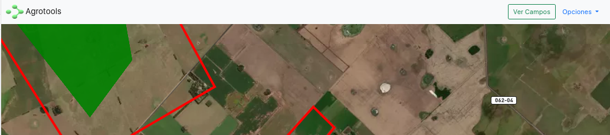

En pantallas pequeñas los botones colapsan en un único botón.

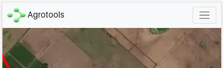

***

## Lista de Campos
Despliega una persiana por la izquierda mostrando la lista de campos del usuario.
Al hacer click el mapa 'vuela' hacia el campo seleccionado y oculta la persiana.

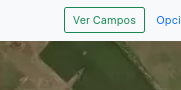
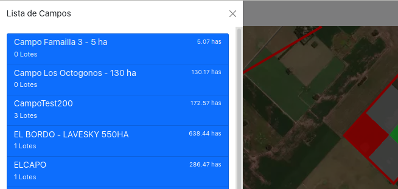

***

## Opcion Color Cultivos 
Cada lote del mapa es coloreado de acuerdo al cultivo del ultimo registro de siembra. Los colores para cada cultivo se pueden modificar a traves del boton "Opciones->Color Cultivos" en la navbar

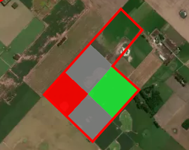

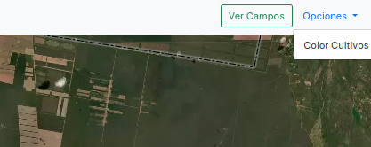
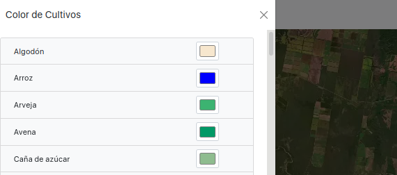

***

## Orden de trabajo con mapa de lotes coloreado
El mapa con la orden de trabajo, marca el perímetro del campo en rojo y los lotes del mismo en azul, destacando el lote donde se tiene que realizar la aplicación en color verde con un marcador en el centro.

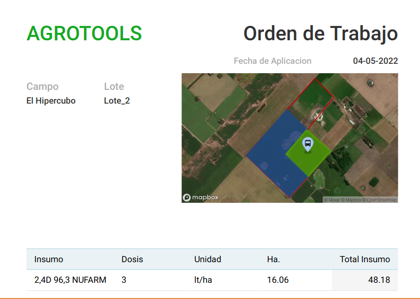

***

## Hectareas del Lote por defecto en siembras, aplicaciones
Por defecto se usan las hectareas del Lote en cuestion

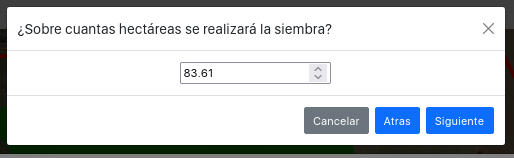

***

## Lista de Cultivos en Siembra

Se muestra una lista de cultivos filtrable mediante la entrada del usuario

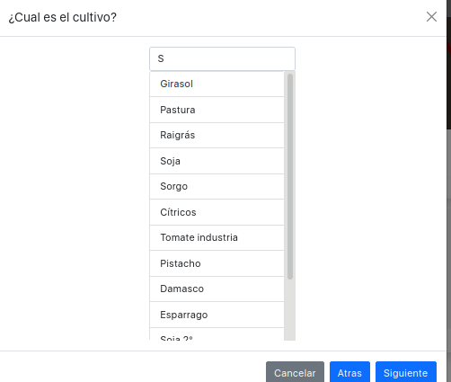

***

## Login en agrotools.netlify.app
En agrotools.netlify.app debe aparecer un modal con un boton que redirige al login de Auth0.

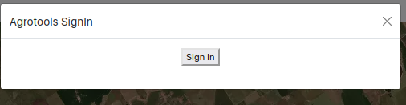